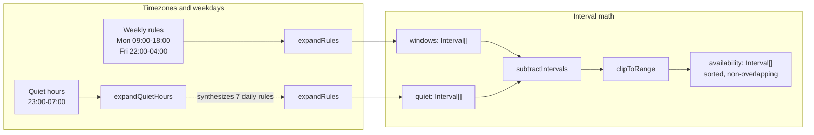
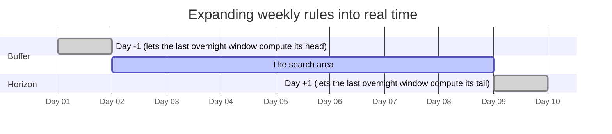
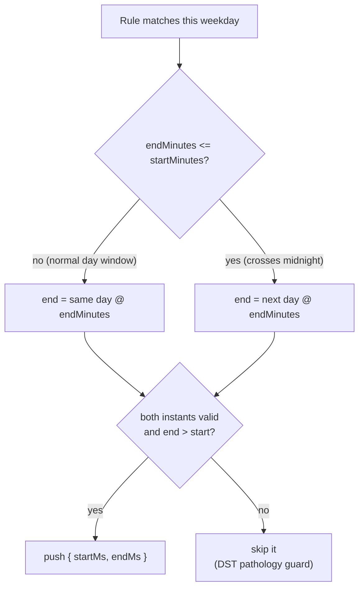
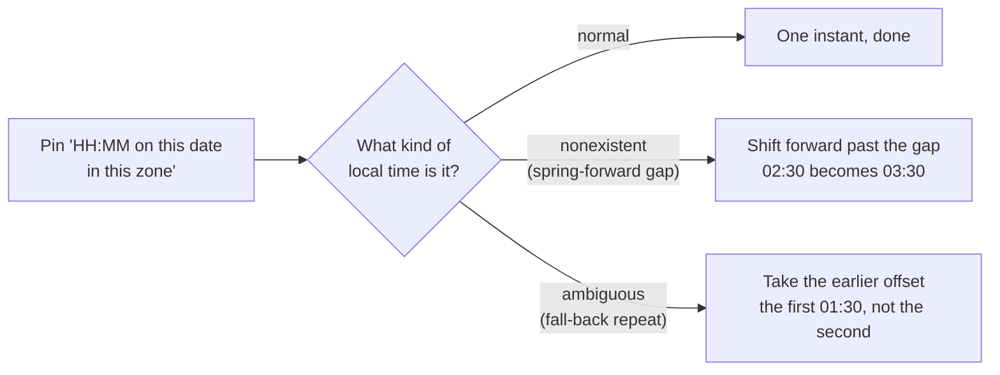
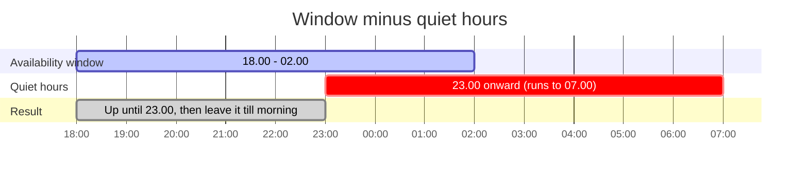
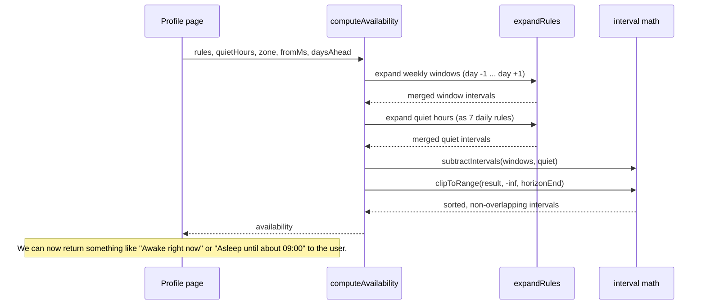

Hello again! So I've been building [WhatTime.to](https://whattime.to), a little site that answers one question: is this person awake right now, and if not, when will they be? You get a link, say when you're usually up, and drop it in your Instagram bio or the group chat. Your friends get an answer like "Awake right now" or "Asleep until about 09:00" instead of the usual "I don't know, ask them." It's a tiny little site, but it has a lot of interesting problems under the hood.

Sounds simple, right? But the more I thought about it, the more I realized that timezones and daylight saving are a minefield. I wanted to make sure the site was correct, and that meant writing a scheduling engine that could handle all the weird edge cases. In this post, I'm going to explain how that engine works.

## Everything is an interval

Internally, I never reason about "9am" as a thing on its own. Every piece of availability gets turned into a concrete, half-open interval of real time. Just a start instant and an end instant in epoch milliseconds.

Half-open means the start is included and the end is not. That sounds pedantic until you have one window ending at 18:00 and another starting at 18:00, and you need them to butt up against each other without overlapping or leaving a gap. More time then I'd care to admit was spent debugging off-by-one errors before I realized that half-open intervals are the standard way to handle this.

Once everything is an interval, the hard-sounding features become boring set operations. Merging overlapping windows, subtracting quiet hours, clipping to a search horizon: all of it is handled by three small utilities (merge, subtract, clip) that know absolutely nothing about timezones or weekdays. All the calendar weirdness gets pushed into one place, and everything after that is just arithmetic on numbers.

Here's the whole pipeline in one picture. Notice that timezones only exist on the left edge:



## Expanding weekly rules into real time

**But, how do we store their availability?**

Your availability is stored as a list of weekly rules, one for each time you're usually up. Each rule has a weekday (1-7, Monday-Sunday) and a start and end time in minutes since midnight. For example, "Mon 09:00-18:00" is stored as `{ weekday: 1, startMinutes: 540, endMinutes: 1080 }`. The engine takes those rules and expands them into real-time intervals for the next week or so.

The expansion walks day by day through your calendar, in your timezone, and for each day it finds every rule matching that weekday and pins the times onto that specific date:

```typescript
for (let i = 0; i <= daysAhead + 1; i++) {
    const day = firstDay.plus({ days: i });
    const weekday = day.weekday as Weekday;
    for (const rule of rules) {
        if (rule.weekday !== weekday) continue;
        const start = wallClockOnDay(day, rule.startMinutes);
        // ...
    }
}
```

Pinning uses Luxon's `DateTime.fromObject` to create a wall-clock time in the correct timezone, and then converts that to epoch milliseconds. The result is a list of intervals that represent your availability in real time.

There are two sneaky things going on with the loop bounds though. First, expansion starts one calendar day _before_ the moment you asked about. This is for the night owls! If your Friday window is 22:00 to 04:00, then at 2am on Saturday you're inside a window that technically belongs to Friday. If I only expanded from "today" forward, the site would tell your friends you're asleep while you're very much online.

Second, it expands one day _past_ the horizon too, for the mirror-image reason: an overnight rule on the last day needs its tail computed correctly before it gets clipped off.



## Overnight windows

Speaking of night owls: a rule where the end time is at or before the start time is treated as crossing midnight. 22:00 to 04:00 means 22:00 tonight until 04:00 tomorrow. The end just gets pinned to the following calendar day and everything else falls out naturally:

```typescript
const overnight = rule.endMinutes <= rule.startMinutes;
const end = overnight
    ? wallClockOnDay(day.plus({ days: 1 }), rule.endMinutes)
    : wallClockOnDay(day, rule.endMinutes);
```

That's it! No special handling for overnight windows anywhere else in the code. The expansion produces a single interval that straddles midnight, and the rest of the engine doesn't care.



## Daylight saving, or: why I anchor to the wall clock

A thing you learn to hate. DST is a nightmare for scheduling. If you store your availability in UTC, then when the clocks spring forward or fall back, your availability shifts by an hour. That means your friends see you as asleep an hour earlier in March and an hour later in November, which is not what you want. So, we anchor the rules to the wall clock instead of UTC. The engine expands the rules in your timezone, and the resulting intervals are in real time.

That matches how humans think about their own schedules. Nobody wakes up an hour early in March because their availability was stored in UTC.

Since the clocks change at 02:00, a rule that starts at 02:30 on the spring-forward day is a problem. That local time simply doesn't exist, so the engine shifts it forward to the nearest valid instant (03:30). Conversely, a rule that starts at 01:30 on the fall-back day happens twice, and the engine resolves that to the earlier offset (the first 01:30, not the second).

```mermaid
gantt
    title Daylight saving time and wall-clock anchoring
    dateFormat HH:mm
    axisFormat %H:%M
    section Normal night
    22.00-06.00 (8 real hours) :active, 22:00, 8h
    section Spring forward
    22.00-06.00 (7 real hours, 02.00-03.00 never happened) :crit, 22:00, 7h
    section Fall back
    22.00-06.00 (9 real hours, 01.00-02.00 happened twice) :done, 22:00, 9h
```



There are two nasty edge cases hiding inside that choice, and I lean on Luxon's well-defined semantics for both. When clocks spring forward, some local times simply don't exist (there is no 02:30 on the gap day), so those get shifted forward to the nearest valid instant. When clocks fall back, some local times happen twice, and those resolve to the earlier offset.



And as a belt-and-braces check, after pinning both ends I throw away any window that came out invalid or inverted:

```typescript
if (!start.isValid || !end.isValid) continue;
if (end.toMillis() <= start.toMillis()) continue;
```

So a pathological rule on a transition day can never produce a negative-length interval. I have tests for all of this and I sleep well at night. Fitting, for this site.

## Quiet hours

Another thing I wanted to add was quiet hours, a period of time where you don't want to be disturbed. For example, 23:00 to 07:00. Quiet hours are treated as a second set of weekly rules, and the engine subtracts them from your availability windows. Simply put, if a window overlaps quiet hours, the overlapping portion gets cut out.

This is done by synthesizing seven daily rules from the quiet hours, one for each day of the week. Then, the same expansion code is used to turn those into real-time intervals, and the subtraction utility handles the rest. The result is that your availability windows are "punched out" wherever they overlap quiet hours.

```typescript
const dailyRules: AvailabilityRule[] = ([1, 2, 3, 4, 5, 6, 7] as const).map(
    (weekday) => ({
        weekday,
        startMinutes: quietHours.startMinutes,
        endMinutes: quietHours.endMinutes,
    }),
);
return expandRules(dailyRules, zone, fromMs, daysAhead);
```

The great thing about this, is we can reuse all of the previous logic for overnight windows and DST. The quiet hours are just another set of rules, and the engine doesn't care that they're "quiet" instead of "available".

If quiet hours start and end at the same time, we treat that as no quiet hours. Otherwise, it’s unclear whether that should mean no block at all or the entire day; and neither is likely what the user intended.

Here's subtraction in action, with a late window running into overnight quiet hours:



## Putting it together
We made it! The final step is to take the expanded windows, subtract the quiet hours, and clip the result to the search horizon. The result is a clean, sorted, non-overlapping list of intervals that represent your availability in real time.

```typescript
const windows = expandRules(rules, zone, fromMs, daysAhead);
const quiet = expandQuietHours(quietHours, zone, fromMs, daysAhead);
const available = subtractIntervals(windows, quiet);
const horizonEnd = DateTime.fromMillis(fromMs, { zone })
    .plus({ days: daysAhead })
    .toMillis();
return clipToRange(available, Number.MIN_SAFE_INTEGER, horizonEnd);
```

Notice the clip is one-sided! Anything past the horizon gets cut off, but anything before the horizon is left alone. That means if you ask "is my friend awake right now?" and they have a window that started yesterday, the engine will return that window and the site will correctly say "Awake right now".



The output of the engine is a list of intervals, and the site just needs to check if the current time is contained in any of those intervals. If it is, your friend is awake. If not, the site finds the next interval and tells you when they'll be up, and then formats that into a human-readable string like "Up in 2h 10m".

## Conclusion
I had so much fun building this engine, and I learned a lot about timezones, daylight saving, and interval math along the way. I hope this post has given you some insight into how WhatTime.to works under the hood, and maybe even inspired you to build something similar.

And, of coruce, i'm biased, but I think WhatTime.to is a pretty neat little site. If you want to check it out, you can find it at [https://whattime.to](https://whattime.to).

Until next time :) 

-Sticks
